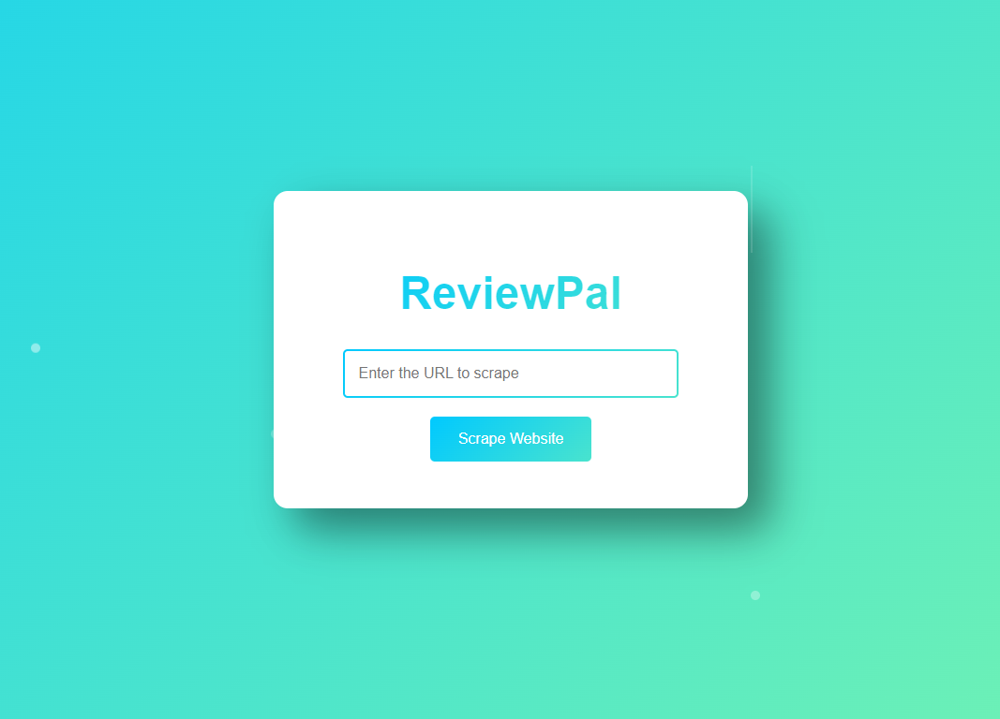

**ReviewPal** is a user-friendly web scraping tool designed to streamline the process of gathering and analyzing product information from Amazon, iHerb, and WebMD. Built with Flask, this tool enables you to scrape customer reviews (up to a specified number) and gain deeper insights into what people are saying. With built-in sentiment analysis, ReviewPal shows whether the reviews are positive, negative, or mixed. By automating the scraping and analysis process, it simplifies how you collect and summarize feedback, offering a clear understanding of customer sentiment for each product.



## Table of Contents
- [Features](#features)
- [Technologies Used](#technologies-used)
- [Installation](#installation)
- [Usage](#usage)
- [Example Insights for Lemon Balm Products](#example-insights-for-lemon-balm-products)
- [Project Structure](#project-structure)
- [Contributing](#contributing)
- [License](#license)

## Features
- **Web Scraping**: Scrapes Amazon, iHerb, and WebMD product pages for information such as product name, price, rating, and reviews.
- **Aspect-Based Sentiment Analysis**: Uses VADER with an extended lexicon to analyze review sentiment across key product attributes like efficacy, taste, and value.
- **BART Summarization**: Generates concise summaries of customer reviews using Facebook’s BART model, ideal for quick overviews.
- **Automatic Chrome Driver Management**: Automatically downloads the correct Chrome driver for ease of setup.
- **Dynamic Review Collection**: Specify the number of review pages to scrape for targeted analysis.
- **CSV Export**: Exports data to CSV files, including sentiment scores, aspect-based insights, and summarized reviews.
- **User-Friendly Interface**: Simple UI for entering URLs and downloading results, created using Flask templating and CSS.

## Technologies Used
- **Python**: Main programming language for web scraping, sentiment analysis, and server-side logic.
- **Flask**: Back-end web framework.
- **Playwright & Selenium**: For asynchronous browser-based scraping.
- **BeautifulSoup**: Parses HTML for data extraction.
- **VADER Sentiment Analyzer**: Performs sentiment analysis with customized lexicon for product-specific attributes.
- **BART**: Used to summarize review content.
- **HTML/CSS**: For building and styling the front-end.

## Installation

### 1. Clone the Repository
```bash
git clone https://github.com/yourusername/reviewpal.git
cd reviewpal
```

### 2. Create a Virtual Environment (recommended)
```bash
python -m venv venv
source venv/bin/activate  # On Windows: venv\Scriptsctivate
```

### 3. Install Dependencies
```bash
pip install -r requirements.txt
```

### 4. Run the Application
```bash
python app.py
```

Visit [http://127.0.0.1:5000](http://127.0.0.1:5000) to access the app. (The app will open a new browser automatically)

## Usage
1. **Enter URL**: Provide an Amazon, iHerb, or WebMD product URL in the input field on the main page.
2. **Scrape Data**: Click “Scrape Website” to start scraping and analyzing the data.
3. **Download CSV**: After processing, download a CSV file with product data, sentiment scores, and summaries.

## Example Insights for Lemon Balm Products

### Top Products

- **Amazon**:
    1. **Traditional Medicinals Organic Lemon Balm Herbal Tea**: $5.99, Rating 4.6, with 39,273 reviews (Positive sentiment, score: 0.568).
    2. **Traditional Medicinals Organic Lemon Balm Herbal Tea** (duplicate entry for another product listing): $5.99, Rating 4.6, with 39,273 reviews (Positive sentiment, score: 0.568).
    3. **Traditional Medicinals Organic Lemon Balm Herbal Tea** (another variant): $5.99, Rating 4.6, with 39,273 reviews (Positive sentiment, score: 0.568).

- **iHerb**:
    1. **Yogi Tea, Stress Relief, Honey Lavender, Caffeine-Free**: $4.48, Rating 4.6, with 29,557 reviews (Highly Positive sentiment, score: 0.935).
    2. **Traditional Medicinals, Organic Chamomile & Lavender Herbal Tea**: $6.49, Rating 4.7, with 8,976 reviews (Highly Positive sentiment, score: 0.917).
    3. **Mommy's Bliss, Kids Sleep Chewable, Melatonin**: $6.98, Rating 4.8, with 5,653 reviews (Highly Positive sentiment, score: 0.857).

### Sentiment Insights

- **Positive Customer Feedback**: The majority of lemon balm products on Amazon and iHerb have positive to highly positive sentiment scores, suggesting high customer satisfaction.

- **High Sentiment Scores**: Products from iHerb generally have higher sentiment scores, indicating more enthusiastic feedback.

- **Common Descriptive Keywords**: Reviews frequently highlight the benefits for stress relief, sleep, and taste, reflecting the popular uses and customer appreciation for these products.

Overall, lemon balm products are consistently praised for their calming and soothing effects, with high ratings and positive feedback on both Amazon and iHerb platforms.

## Project Structure

```bash
├── static
│   └── style.css         # Styles for the front-end
├── templates
│   └── index.html        # HTML template for the main UI
├── app.py                # Flask app and main scraping logic
├── requirements.txt      # Required packages
└── README.md             # Documentation
```

### File Overview:
- **index.html**: Front-end template that includes the input form and visual layout of the application.
- **style.css**: The stylesheet that adds modern, aesthetic styling to the webpage, such as gradients and animations.
- **app.py**: Main application logic for web scraping, sentiment analysis, and file generation.
- **requirements.txt**: Lists all the dependencies used in this project (Flask, BeautifulSoup, aiohttp, etc.).
- MUST RUN ON PYTHON 3.12 OR NEWER

## Contributing

We welcome contributions! Feel free to fork the repository, create a new branch, and submit a pull request with your improvements.

## License

This project is licensed under the MIT License. See the [LICENSE](LICENSE) file for details.
