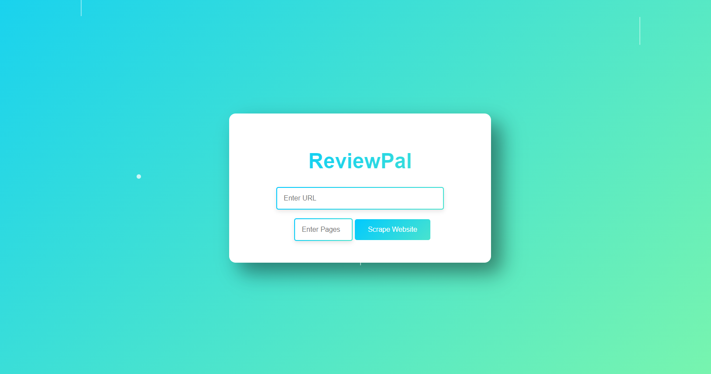

# ReviewPal

**ReviewPal** is a user-friendly web scraping tool designed to streamline the process of gathering and analyzing product information from Amazon and iHerb. Built with Flask, this tool enables you to scrape customer reviews (up to a specified number) and gain deeper insights into what people are saying. With built-in sentiment analysis, ReviewPal shows whether the reviews are positive, negative, or mixed. By automating the scraping and analysis process, it simplifies how you collect and summarize feedback, offering a clear understanding of customer sentiment for each product.



## Table of Contents
- [Features](#features)
- [Technologies Used](#technologies-used)
- [Installation](#installation)
- [Usage](#usage)
- [Project Structure](#project-structure)
- [Contributing](#contributing)
- [License](#license)

## Features
- **Web Scraping**: Scrapes Amazon product pages for information such as product name, price, rating, and reviews.
- **Sentiment Analysis**: Uses VADER (Valence Aware Dictionary and sEntiment Reasoner) to analyze customer reviews and calculate a sentiment score.
- **Asynchronous Requests**: Uses `aiohttp` and `asyncio` to asynchronously fetch reviews and product details.
- **Dynamic Review Collection**: Allows users to specify the number of pages of reviews to scrape.
- **CSV Export**: Results are exported to a CSV file containing product information and the sentiment scores of reviews.
- **Clean and Responsive UI**: Modern, simple, and aesthetically pleasing UI using HTML, CSS, and Flask templating.

## Technologies Used
- **Python**: Core logic of the app, including scraping and sentiment analysis.
- **Flask**: Python micro web framework used for the back-end.
- **aiohttp & asyncio**: For making asynchronous HTTP requests.
- **BeautifulSoup**: For HTML parsing and data extraction from Amazon pages.
- **VADER**: A sentiment analysis tool to evaluate customer reviews.
- **HTML/CSS**: For structuring and styling the front-end.

## Lemon Balm Products Summary:

Top Products:
- Highest-Rated Products:
  1. Elire - Organic Lemon Balm Extract: Rating 5.0, with 24 reviews.
  2. Lemon Balm Leaf Cut & Sifted Organic - Melissa officinalis: Rating 4.7, with 956 reviews.
  3. Frontier Co-op Organic Cut & Sifted Lemon Balm: Rating 4.7, with 620 reviews.
  4. Traditional Medicinals Tea, Organic Lemon Balm: Rating 4.7, with 40,007 reviews.
  5. Lemon Balm - Melissa officinalis Dried Loose Leaf: Rating 4.7, with 294 reviews.

- Most Reviewed Products:
  1. Traditional Medicinals Tea, Organic Lemon Balm: 40,007 reviews with a rating of 4.7.
  2. Lemon Balm (Herbal Tea): 20,000 reviews with a rating of 4.6.
  3. HANDPICK, Lemon Balm Tea Bags (100 Herbal Tea Bags): 10,644 reviews with a rating of 4.4.

Sentiment and Price Insights:
- The correlation between price and sentiment score is -0.03, indicating a very weak negative relationship between price and sentiment. Higher price doesn't necessarily mean better sentiment.

Common Descriptive Keywords:
- The most frequent positive words used to describe these lemon balm products are:
  - Taste (mentioned 12 times)
  - Good (mentioned 11 times)
  - Sleep (mentioned 6 times)
  - Quality (mentioned 3 times)
  - Anxiety (mentioned 3 times)

Summary:
Overall, lemon balm products are highly rated and reviewed, especially for their taste, quality, and positive effects on sleep and anxiety. Products like Traditional Medicinals Tea stand out with an overwhelming number of positive reviews. These products appear to be well-regarded for both their flavor and calming effects.
"""

## Installation
### 1. Clone the Repository
```bash
git clone https://github.com/yourusername/ai-scrapper.git
cd ai-scrapper
```

### 2. Create a Virtual Environment (optional but recommended)
```bash
python -m venv venv
source venv/bin/activate  # On Windows: venv\Scripts\activate
```

### 3. Install Dependencies
```bash
pip install -r requirements.txt
```

### 4. Run the Application
```bash
python app.py
```
Navigate to `http://127.0.0.1:5000` in your browser to access the application.

## Usage
1. **Input URL**: Enter the URL of an Amazon product in the input field on the homepage.
2. **Scrape Reviews**: Click the "Scrape Website" button (or the search icon) to start scraping reviews and performing sentiment analysis.
3. **Download Results**: After scraping, the application will provide a downloadable CSV file with product details and sentiment analysis. You can check the sample data format in the provided `GOODreviews.csv` file.


## Project Structure
```bash
├── static
│   └── style.css           # CSS for styling the front-end
├── templates
│   └── index.html          # HTML template for the main UI
├── app.py               # Flask application with scraping and sentiment analysis logic
├── requirements.txt        # Required Python libraries
└── README.md               # Project documentation
```

### File Overview:
- **index.html**: Front-end template that includes the input form and visual layout of the application.
- **style.css**: The stylesheet that adds modern, aesthetic styling to the webpage, such as gradients and animations.
- **app.py**: Main application logic for web scraping, sentiment analysis, and file generation.
- **requirements.txt**: Lists all the dependencies used in this project (Flask, BeautifulSoup, aiohttp, etc.).
- MUST RUN ON PYTHON 3.12 OR NEWER

## Contributing
Feel free to fork the repository, create a new branch, and submit a pull request. Contributions are welcome!

## License
This project is licensed under the MIT License - see the [LICENSE](LICENSE) file for details.

